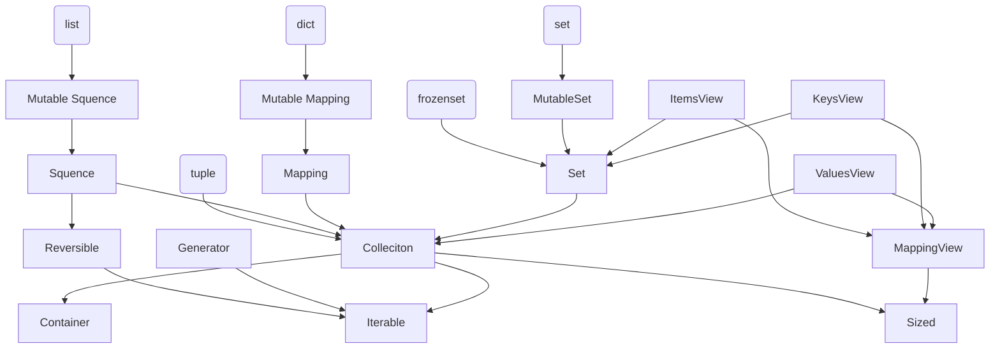

# Getting Started <br> with Statically Typed Programming <br> in Python 3.10

<div class="absolute bottom-10">
  <span class="font-500">
    Peacock (Yoichi Takai), at PyCon US 2022
  </span>
</div>

<!-- Hi, let's start. my talk title is ...-->

---
layout: section
---

# Prolog

## Self-introduction, Table of contents

---

<div class="grid grid-cols-[75%,25%] gap-2">

<div>

Slides: <https://slides.peacock0803sz.com/us-pycon-2022/>
<Tweet id="1489392519813107713" />

</div>

<div>
    
</div>

</div>
---

<!-- If you have any questions or comments, please write here. I'd love to hear from you during the talk. -->
<!-- Nice to meet you. Hello EuroPython! -->

<!-- let me introduce myself. -->
<!-- In addition to my work, I'm also involved at the PyCon JP Association -->

# Self-introduction

<div class="grid grid-cols-[70%,30%] gap-2">

<div>

- Name: Peacock / Yoichi Takai
    - [Twitter](https://twitter.com/peacock0803sz/) / [GitHub](https://github.com/peacock0803sz/) / [Facebook](https://www.facebook.com/peacock0803sz): `peacock0803sz`
    - **Please call me Peacock**
- Favourites
    - Playing the Clarinet
    - Listening Music (Most is classical)
    - Skiing, Gadgets...

</div>

<div>
    
</div>
</div>

---

- Company: [CMScom](https://cmscom.jp) (Full-time since 2020/06 ~)
    - Web application developer, Flask / Pyramid / Plone / FastAPI
- Member of PloneJP (Plone User's Group in Japan)
- Staff of PyCon JP (since 2020 - ), 2022: Vice Chair
- Operating Member of [PyCon JP Association](https://www.pycon.jp)
    - Director of [PyCon JP TV](https://tv.pycon.jp)(YouTube live about PyCons and local events held once a month)
- I have experience learning haskell and typescript.
- Now, reading "[Types and Programming Languages](https://www.cis.upenn.edu/~bcpierce/tapl/)" (a.k.a. TaPL)

---

<!-- this is today's topic. -->

# Today's topic

1. Why do I talk about typing?
2. Introduction of typing, How to write basically **(I most want to say)**
3. Generics, User-Defined types (Best practice included)
4. Updates overview recently & Backward compatibility for 3.9 or before
5. Overview of new features on 3.10

---

<!-- My motivation for talking is to get the word out in a coherent way. -->
<!-- It's been five years (Python 3.5, at 2015) since typing appeared -->

# Why do I talk about typing?

- It's been five years since typing appeared
    - In Python 3.5, at 2015
- Several big PEPs were adopted and updated over the years
- Even now, I think many people **don't know where to start**
	- Because there is little coherent information

---

# I will not talk about

- Developing library with typing
- Configures and options of mypy
- How to use them in CI, ex: GitHub actions, Circle CI and etc...
- History of type hinting
- Implementation of typing, mypy
- Abstract Syntax Tree (AST)

---
layout: section
---

<!-- OK, Let's take a look at how to actually start Typing! -->

# Introduction of typing
## How to write basically

---

<!-- First, let's look at what typing can do for you. -->

# What makes you happy?

- It knows the type when you reference it in the editor.
- It gets angry when I try to give it the wrong one.
- The completion will work when accessing the return value of a function using a dot.

---

<!-- this is a minimal example. -->
<!-- we don't know the type of return value... -->
<!-- if try to pass int to the function, it'll occur an error -->

## Without the type hint


We don't know the error...


---

<!-- How about this case? It looks like s is str, a return value is also str.-->

## With the type hint


<!-- and, the editor can tell the argument is wrong -->

## Editor tells a wrong argument


---

<!-- and more, there are advantages to code review. -->

# In a code review

The reviewer can know variables or function returns types.

<!-- w/o type hint, reviewer, can't know the return type from reading the definition. -->
<!-- As a result, many people may have had this experience. -->

## Without the type hint

Boss < What type does this function return?
You < Humm... str or False or None ...?
Boss < THAT'S TOO MANY TYPES!
You < :-(

```py {2|3|4}
def need_new_post():
    if ...: retrun None
    elif ...: retrun False
    else: return post_id  # this is str
```

---

<!-- However, Type hint may make the review process more smooth. -->

## With the type hint

Boss < It looks like this function may return 3 types... Isn't that too much?
You < I see. That could be a bad design. Let me fix it.
Boss < Sure, please.

```py {1|2|3|4}
def need_new_post() -> None | False | str:
    if ...: retrun None
    elif ...: retrun False
    else: return post_id  # this is str
```

---

# Let's start with function definitions

- After the arguments, write colon and type
- Before the colon at the end of the function definition, write an arrow and type


---

## Using built-in types

<!-- now, Let's take a look at the types that can be used in practice. -->

- `bool`, `bytes`, `float`, `int`, `str`
    - you don't need to do anything to use them.
- `None`: used for functions that return nothing.

## Escaping from type puzzles

<!-- If you want to escape from complex type puzzles, you can use any. this is the final resort. -->

- `Any` Can hold instances of any type.
- It's better not to use it.
    - Import and use from `typing` when necessary.

```py
from typing import Any
very_dangerous_last_resort: Any
```

---

# (Since 3.9) Generics in standard Collections

- `dict`, `frozenset`, `list`, `set`, `tuple`
    - Collections can be written with `[]` for the type inside.
        - 3.9 and later only
        - 3.7, 3.8 write `from __future__ import annotaions` (see below)
        - 3.6: import annotations starting with uppercase letters from `typing` (next section)
    - ref: [official documentation ](https://docs.python.org/3.9/whatsnew/3.9.html#type-hinting-generics-in-standard-collections)

---

- Until 3.8, it was from `typing`, but now it's depreciated.
- For `__builtins__` start with lowercase without doing anything.
    - Such as `list`, `tuple`, and `dict` etc...

- For `collections` (ex: deque, defaultdict, ...), import modules start with `collections`
- iterable, callable, and other protocol-related items import modules start with `collections.abc`.
- regular expressions from `re`. 
- Context-related items are available in `contextlib`.

---

# (Deprecated since 3.9) import from typing module

- For Generics, until 3.9, you had to write `from typing import ...`
    - Such as `Dict`, `List` and `Tuple` etc...
- From 3.9, it's deprecated.

<!-- because of the way of writing described before. -->

```py
from typing import Dict, List, Tuple, ...  # before 3.9
def some_function() -> Tuple[List[int], Dict[str, bool]]: pass
```

Since 3.9, no more need these import statement!
```py
def some_function() -> tuple[list[int], dict[str, bool]]: pass
```

---

# Using different types of collections

<!-- There are many types in `collections.abc.`  -->
<!-- Although it's unlikely that you will use these in a fine-grained way, It's better to choose a collection with as few methods as possible to increase portability. -->
<!-- The following figure shows the relationship between `collections.abc` and a sequence of built-in types defined by method inclusion rather than implementation inheritance.  -->
<!-- It is a good idea to look at the methods used in your functions and choose the types on the left side of this diagram as much as possible. -->

- There are many types in `collections.abc`.
- It's better to use a collection with a few methods to increase portability.
- The following figure shows the relationship.
    - The further to the left you go, the fewer methods it has.
    - To the right, the more methods it has.
- It's a good idea to look at the methods used in your functions.
    - Choose the types on the left side of this diagram as much as possible.

---

<div class="absolute top-5">

# Great method inheritance tree



</div>

<!-- The further to the left you go, the fewer methods it has. -->
<!-- To the right, the more methods it has. -->

<!-- For example, if you just want to loop over a sequence of arguments in a function, you can use collections.abc.Iterable. Iterable. If you need random access, use Sequence. If you need to change the value, use a type with Mutable. -->

<!-- Or, if you simply specify list as the argument type, you will not be able to pass set or dict. In particular, it is better not to set concrete types (list, tuple, dictionary, set) just because you are familiar with them. However, I think it is easier to understand using these concrete types, so you may want to first apply these concrete types. After you confirm that you can use fewer operators and methods, you may want to gradually move to the left side of the types. -->

<!-- TODO: REPLACE with mermeid! -->
<!--  -->

---

# The difference between tuple and others Sequences

- Tuples are fixed up to the length information
    - Specify the type for the number of elements
        - Or you can mix types, such as tuple[int, str, float]. 
- A sequence, such as a list, has the same constraint for all elements in the element
    - Can be used regardless of the length of the sequence by setting only one element.

---
layout: section
---

# A little more advanced: Generics type

<!-- Next, there are few advanced types. -->

---

<!-- at first is union, merged type. top half code is an Example A function that accepts both integers and floats bottom one is Union objects can be tested for equality with other union objects. -->

# Union (Mager type)

- `Union`: merged type, can be represented by `|` since 3.10
    - You've probably seen it on Haskell or TypeScript

```py {2}
from __future__ import annotations
def square(number: int | float) -> int | float:
    return number ** 2
```

Union objects can be tested for equality with other union objects.

```py {1|2|3|4}
(int | str) | float == int | str | float  # Unions of unions are flattened
int | str | int == int | str              # Redundant types are removed
int | str == str | int                    # the order is ignored
int | str == typing.Union[int, str]       # Compatible with typing.Union
```

---

<!-- A generic type is typically declared by inheriting from an instantiation of this class with one or more type variables. -->

# Optional type

- Shorthand, `Optional[T]` is equivalent to Union with None.
    - Behaves just like Union: `T | None`
- If you use it in a function return value or something, it will propagate, so be careful how you use it.

```py {2|3-}
from typing import Optional
age: Optional[int]
age = 17
age = None # This is also valid
```
---

# Avoid using Optional as much as possible

- Optional is useful but causes code bloat.

```py {2|3,4|5}
def get_content() -> str | None:
    r = request.get("https://example.com")
    if r.status_code != 200: # This is the guard (early return)
        logging.warning("HTTP response is %d!", r.status_code)
        return None
    return r.text
```

- When you use the up function, you might write another guard and return `None`.
- As a result, we need to write a guard to the previous method, which reduces readability.

---

In this case

- It would be cleaner to raise a `raise RuntimeError`.
    - The cost of raising exceptions in Python is (relatively) low
        - The performance would be satisfactory.
- The lack of null-safe methods in Python is also a factor
    - But if there were such methods, they would be abused.
    - Null-safe means a method that does not raise an exception when passed None.

---

# Callable (callable object)

It can be used when writing functions that take a function as an argument, such as decorator functions.

```py {1,2,3|6|11,12|13|14,15|16}
from collections.abc import Callable  # since 3.9
from functools import wraps
from typing import Literal
def validate(
    func: Callable,
) -> Callable[..., Callable | tuple[Response, Literal[400]]]:
    @wraps(func)
    def wrapper(*args, **kw) -> Callable | tuple[Response, Literal[400]]:
        try:
            j = request.json
            if j is None:
                raise BadRequest
        except BadRequest:
            j = jsonify({"data": [], "errors": {"message": ERR_MSG, "code": 400}})
            return r, 400
        return func(*args, **kw)

    return wrapper

```

---

<!-- A generic type is typically declared by inheriting from an instantiation of this class with one or more type variables. -->

# User-defined Generic types

A generic type is typically declared by inheriting from an instantiation.

Example: a generic mapping type

```py {2|3|4}
from typing import TypeVar, Generic
KT, VT = TypeVar("KT"), TypeVar("VT")
class Mapping(Generic[KT, VT]):
    def __getitem__(self, key: KT) -> VT: pass
```

This class can then be used as:

```py {1|2|3|4}
X, Y = TypeVar("X"), TypeVar("Y")
def lookup_name(mapping: Mapping[X, Y], key: X, default: Y) -> Y:
    try: return mapping[key]
    except KeyError: return default
```

---
layout: section
---

# Updates Overview <br> & How to use new features in older versions

---

<!-- this is an updated overview recently. -->

# Recent Python updates

https://www.python.org/downloads/

| Ver. | Status   | Release | EoS     | Release PEP                                      | Main new feature          |
| ---- | -------- | ------- | ------- | ------------------------------------------------ | ------------------------- |
| 3.11 | beta 4   | 2021-10 | 2026-10 | [619](https://www.python.org/dev/peps/pep-0619/) | Pattern matching          |
| 3.10 | bug fix  | 2021-10 | 2026-10 | [619](https://www.python.org/dev/peps/pep-0619/) | Pattern matching          |
| 3.9  | bug fix  | 2020-10 | 2025-10 | [596](https://www.python.org/dev/peps/pep-0596/) | Union operators to dict   |
| 3.8  | security | 2019-10 | 2024-10 | [569](https://www.python.org/dev/peps/pep-0569/) | `=` in f-string           |
| 3.7  | Security | 2018-06 | 2023-06 | [537](https://www.python.org/dev/peps/pep-0537/) | Data classes              |
| 3.6  | Security | 2016-12 | 2021-12 | [494](https://www.python.org/dev/peps/pep-0494/) | Literal string (f-string) |

---

<!-- Let's talk about dunder future, which has come up many times before. -->
<!-- Modules and methods with two underscores at either end are pronounced dunder. -->

# What is the `__future__` module: (dunder future)?

- It exists for backward compatibility.
- Using typing new feature in the older versions, write `from __future__ import annotations`
- It describes when disruptive changes are introduced and become mandatory.
- In addition to typing, it was also used to call 3.x features in 2.x.
    - ex) `print_func`, `unicode_literals` etc ...
- refs: [\_\_future\_\_](https://docs.python.org/3/library/__future__.html), [future statement](https://docs.python.org/3/reference/simple_stmts.html#future)

---

<!-- next topic is new features in python3.10, will be released Nov. this year there is a difficult feature. I'm not sure I can explain it well, either. -->

# New Features Related to Type Hints in 3.10

---

# PEP 604: New Type Union Operator

- The union above type can be used as an operator.
- You can also use it when asking `isinstance()`.
- More intuitive since TypeScipt and others use this notation.

```py
int | str == typing.Union[int, str]  # Compatible with typing.Union
```

---

# PEP 612: Parameter Specification Variables

## Motivation

- Tring to write a generic decorator, it's difficult to write the type
- Needed a way to represent a function that has the **same arguments as the specified function**

```py {4,5|10-}
from typing import Callable, TypeVar
Ps, R = TypeVar("Ps"), TypeVar("R")

def add_logging(f: Callable[Ps, R]) -> Callable[Ps, R]:
    def inner(*args, **kwargs) -> R:  # args: tuple...?, kwargs: dict...?
        log_to_database()
        return f(*args, **kwargs)
    return inner

@add_logging
def foo(x: int, y: str) -> int:
    return x + 7
```

---

## Approach

- Adding an argument type called `ParameterSpecification` solves the problem.
- It can be used with `Callable` to behave like a generic callable object. (You can think of it as an argument version of `TypeVar`.)

```py {2|4,5|10-}
from typing import Callable, ParameterSpecification, TypeVar
Ps, R = ParameterSpecification("Ps"), TypeVar("R")

def add_logging(f: Callable[Ps, R]) -> Callable[Ps, R]:
    def inner(*args: Ps.args, **kwargs: Ps.kwargs) -> R:
        log_to_database()
        return f(*args, **kwargs)
    return inner

@add_logging
def foo(x: int, y: str) -> int: return x + 7
```

---

# PEP 613: TypeAlias

## Motivation
- We consider global variables without type hints to be type aliases.
    - This tends to cause problems with forwarding references, scoping, etc.
    - So, we're going to make it possible to explicitly define type aliases.
- You can still define type aliases implicitly.

---

## Approach

- Add a new `typing.TypeAlias`
    - Write a variable of type alias type like `T: TypeAlias = int`
- Variables defined at the global level are considered type aliases.
- Using ForwardReference, you can write `T: TypeAlias = "int"`.

## Example

```py {1,2|4,5|7,8}
x = 1  # untyped global expression
x: int = 1  # typed global expression

x = int  # untyped global expression
x: Type[int] = int  # typed global expression

x: TypeAlias = int  # type alias
x: TypeAlias = “MyClass”  # type alias
```

---

# PEP 647: User-Defined Type Guards

## Motivation

Type checker tools use a technique called type narrowing to determine the type of information.
In this example, the `if` statement and `is None` are used to automatically narrow down the type.

```py {3|5}
def func(val: Optional[str]):
    # "is None" type guard
    if val is not None: # Type of val is narrowed to str
        pass
    else: # Type of val is narrowed to None
        pass
```

---

However, that will not work as intended if the user function is used.

```py
  def is_str_list(val: List[object]) -> bool:
    """Determines whether all objects in the list are strings"""
    return all(isinstance(x, str) for x in val)

  def func1(val: List[object]):
    if is_str_list(val): print(" ".join(val))  # Error: invalid type
```

- `TypeGuard` allows you to define user-defined type guards via the new typing.
- By using user-defined type guards, it is easier to get support for type narrowing.

---

<!-- The type checker assumes that the first argument matches the type specified in TypeGuard, if the function returns True. In the above example, data that passes is_str_list() will be treated as List[str]. -->

<!-- Note that if this function returns False, type narrowing will not be performed. -->
<!-- In the following example, if is_two_element_tuple(...) block, the type is narrowed to Tuple[str, str] as a result of type narrowing, while in the else block, the type remains unchanged. -->

```py
from typing import TypeGuard
def is_str_list(val: List[object]) -> TypeGuard[List[str]]:
    return all(isinstance(x, str) for x in val)  # this is vaild!
```

And, type narrowing works like this:

```py
def is_two_element_tuple(val: Tuple[str, ...]) -> TypeGuard[Tuple[str, str]]:
    return len(val) == 2

OneOrTwoStrs = Union[Tuple[str], Tuple[str, str]]
def func(val: OneOrTwoStrs):
    if is_two_element_tuple(val): reveal_type(val)  # Tuple[str, str]
    else: reveal_type(val)   # OneOrTwoStrs
```

---


# Summary

1. Introduction
    1. Motivation, Let's start writing, Built-in types
    2. Standard collection type hints starting with lowercase (3.9)
2. Collections and Generics
    1. Union, Optional, Callable, User-defined Generics
3. Updates Overview & How to use new features in older versions
4. Python 3.10 style type hinting
    1. New Type Union Operator, Parameter Specific Variables, TypeAlias, User-Defined Type Guards

---

# Pages I used for reference (Thanks)

<!-- There are links that I referenced -->

- https://docs.python.org/3/library/typing.html
- https://docs.python.org/3.10/whatsnew/3.10.html
- http://mypy-lang.org
- https://future-architect.github.io/articles/20201223 (ja)
- https://qiita.com/tk0miya/items/931da13af292060356b9 (ja)
- https://qiita.com/tk0miya/items/1b093c2eee7668fffb62 (ja)
- https://qiita.com/tk0miya/items/a27191f5d627601930ed (ja)


---
layout: fact
---

# Thank you!


